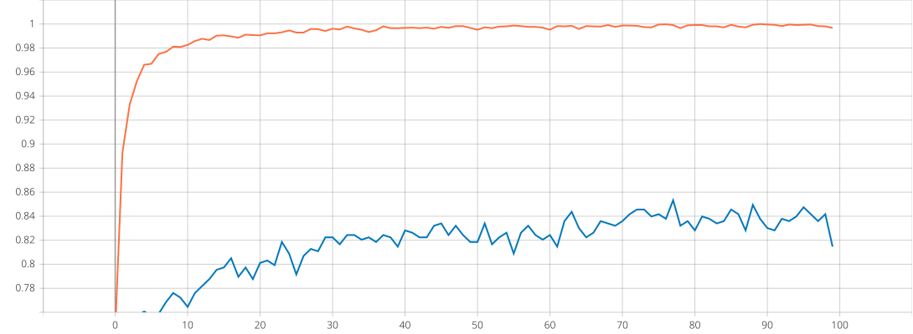
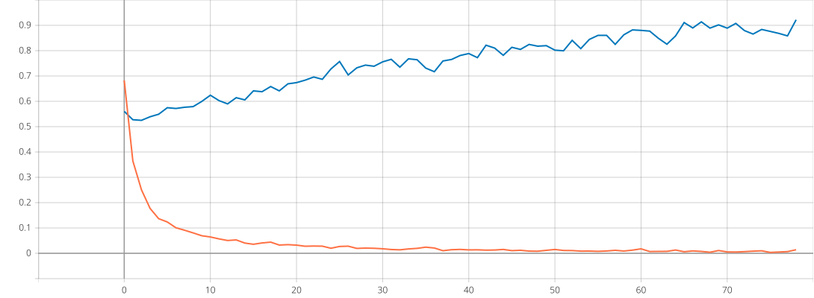
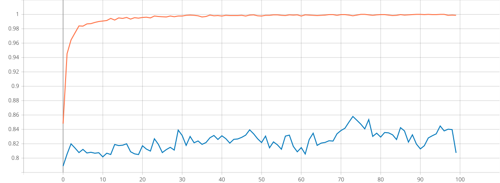
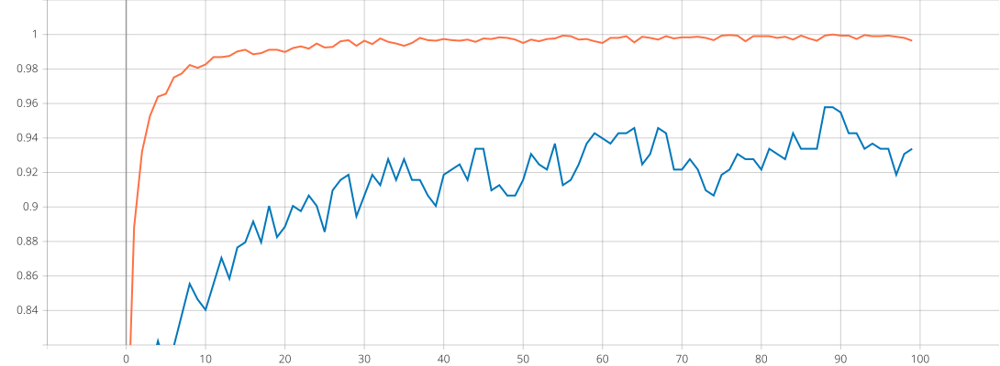

###### *See this repository on [DAGsHub](https://dagshub.com/arjvik/BEEHealthy) and [GitHub](https://github.com/arjvik/BEEHealthy)*

# BEE Healthy!

#### AI-Powered Assessment of Bee Colony Health

Utilizing Machine Learning techniques to identify sick bees in a cost-effective manner

## Model Training

Using a ResNet50-based architecture, we performed transfer learning on a frozen ImageNet-trained model for 100 epochs and selected the best checkpoint based on validation metrics (#89).

| **Accuracy**<br /> | **Loss**<br />          |
| ------------------------------------------------------------ | ------------------------------------------------------------ |
| **Precision**<br /> | **Recall**<br /><br /> |

[Download Model](https://dagshub.com/arjvik/BEEHealthy/raw/master/model.h5)

### Validation performance

```python
Epoch 89/100
loss: 0.0032 - binary_accuracy: 0.9994 - precision_1: 0.9997 - recall_1: 0.9993
val_loss: 0.8938 - val_binary_accuracy: 0.8494 - val_precision_1: 0.8325 - val_recall_1: 0.9578
```

**Validation Accuracy:** 84.94%  
**Validation Precision:** 83.25%  
**Validation Recall:** 95.78%
